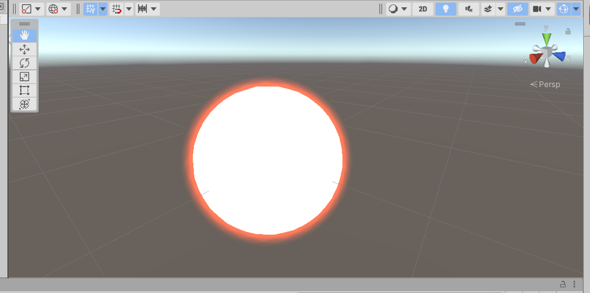
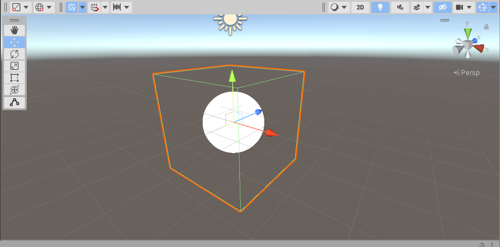
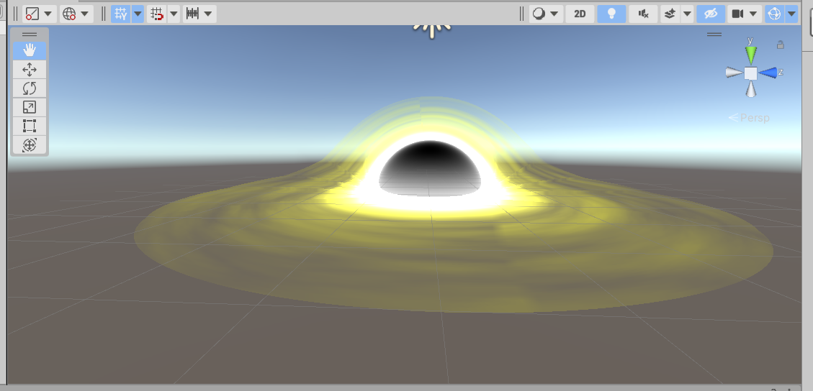
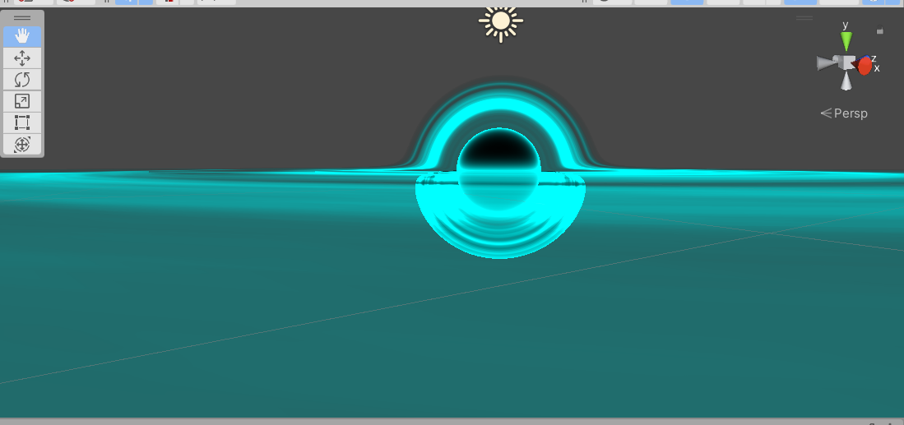

# Unity Shader

## 辉光Bloom（未完成）
后处理效果
Shader/Bloom

## 透镜Lens（未完成）
后处理效果
Shader/Lens

## 受伤警告后处理
Shader/Death

## 外发光OutLine
两层Pass，第二层剔除正面且发光，不适合有棱角的物体
Shader/OutLine

## 圆环距离场ToursSDF
RayMarching
Shader/RayMarching/ToursSDF

## 球体距离场SphereSDF
RayMarching
Shader/RayMarching/ToursSDF

## 黑洞BlackHole(RayMarching实现)
RayMarching
Shader/RayMarching/BlackHole
UrpShader/RayMarching/BlackHole

## 黑洞BlackHoleV2(RayMarching实现)
RayMarching
Shader/RayMarching/BlackHoleV2

## 黑洞BlackHole(ShaderGraph透明扭曲)
UrpShader/RayMarching/Hole
